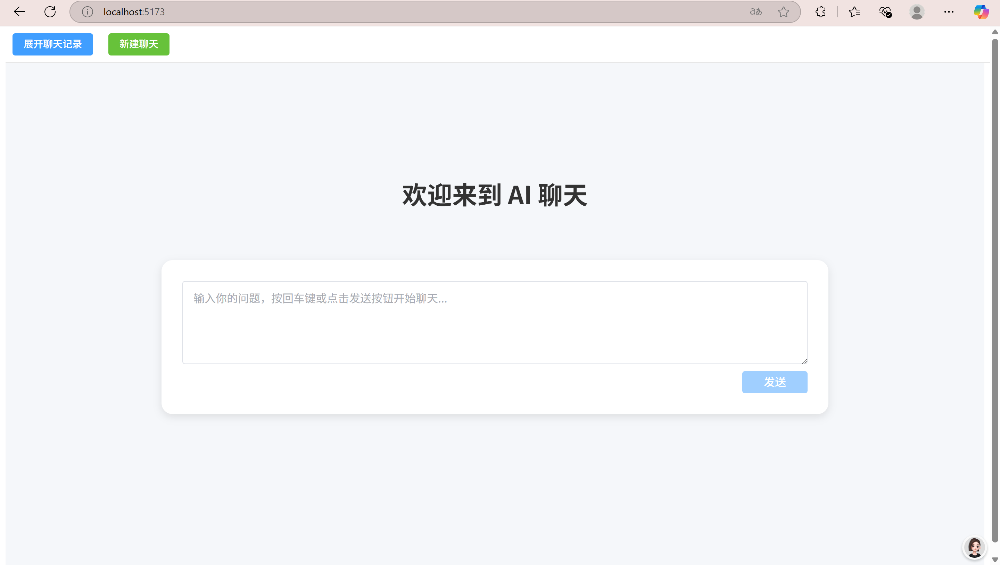
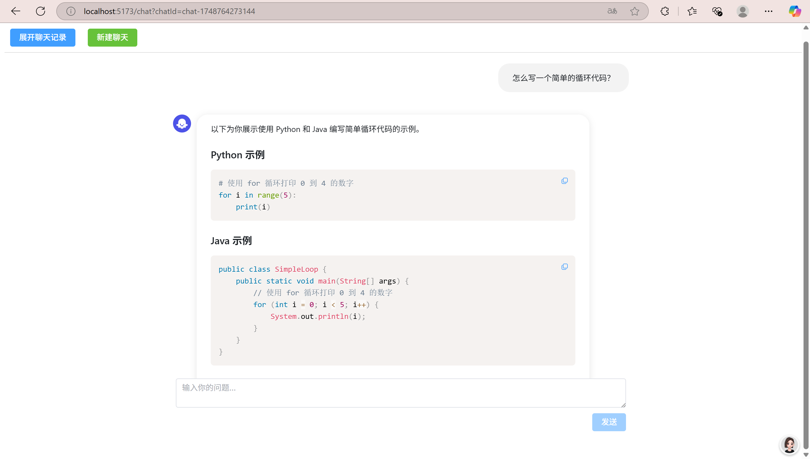
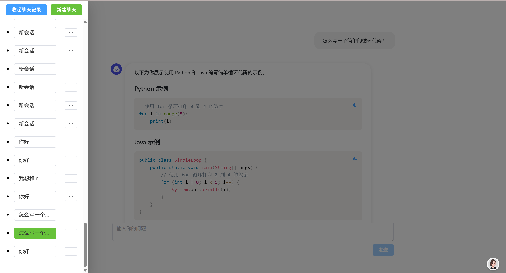

---

# LLM 对话框组件（Vue3 + Element Plus）

## 项目简介

本项目是一个基于 Vue3 + Element Plus 的大模型（LLM）对话平台，致力于为用户提供类似 ChatGPT、Claude、Coze 等主流 AI 聊天产品的交互体验。项目支持多轮对话、历史会话管理、代码高亮、消息复制等功能，界面美观，交互流畅。

## 项目背景

随着大模型（LLM）技术的普及，越来越多的产品采用对话框模式与用户交互。该项目参考了字节跳动 LLM 对话框组件2.0 的设计要求，旨在实现一个可扩展、易用、体验优秀的前端对话系统。

> 参考文档：[【前端项目一】LLM 对话框组件2.0](https://bytedance.larkoffice.com/docx/YP0Md2LwCoelRQxnwiZc5DWUndb)

项目最初是与线上朋友一起组队开发，所有代码都写在同一个文件中。目前正在进行代码重构，将组件解耦，提升代码质量和可维护性，逐步完善项目架构。

## 主要功能

- **多轮对话**：支持与 AI 进行多轮连续对话，消息自动滚动到底部。
- **历史会话管理**：支持会话列表，自动保存历史记录，支持重命名、删除、切换会话。
- **会话摘要**：历史会话列表显示每个会话的首条用户消息摘要，便于快速区分。
- **代码高亮与复制**：AI 回复支持 Markdown 代码高亮，代码块右上角一键复制。
- **UI 优化**：采用卡片式设计，输入框自适应，界面简洁美观，支持响应式布局。
- **错误处理**：对 API 错误、网络异常等情况有友好提示。
- **本地数据持久化**：
  - 使用 localStorage 存储聊天历史记录
  - 对 localStorage 的读写操作进行防抖处理（500ms）
  - 支持会话数据的自动保存和恢复
  - 页面刷新后可以保持会话状态

## 技术栈

- **前端框架**：Vue 3（Composition API + `<script setup>`）
- **UI 组件库**：Element Plus
- **状态管理**：Pinia
- **路由管理**：Vue Router
- **代码高亮**：Prism.js
- **Markdown 渲染**：marked
- **类型系统**：TypeScript
- **构建工具**：Vite

## 项目结构

```
src/
  components/    # 组件（对话框、输入框、历史记录、导航栏等）
  pages/         # 页面（首页、聊天页等）
  stores/        # Pinia 状态管理
  assets/        # 静态资源与全局样式
  App.vue        # 根组件
  main.ts        # 入口文件
```

## 亮点与创新

- **极致用户体验**：对话流畅，界面美观，细节打磨（如滚动条隐藏、消息气泡间距优化）。
- **高可维护性**：TypeScript 全面类型约束，组件解耦，易于扩展。
- **性能优化**：localStorage 操作和滚动监听均做了防抖处理。
- **代码块体验**：代码块支持一键复制，提升开发者用户体验。

## 部分未完成/可扩展功能

- **多媒体消息支持**：暂未实现图片、PDF 等多媒体输入输出。
- **分组会话（如"今天"、"昨天"）**：目前历史会话未分组显示。
- **多端适配**：移动端体验有待进一步优化。
- **权限与多用户支持**：当前为单用户本地体验，未接入后端用户体系。

## 快速开始

```bash
# 安装依赖
npm install

# 启动前端开发环境
npm run dev

# 启动后端服务
cd src
node server.js
```

访问 http://localhost:5173 即可打开应用。

## 体验截图

### 首页
首页采用简洁的设计风格，突出核心功能，用户可以直接在输入框中输入问题开始对话，或者通过左侧按钮查看历史对话记录。



### 聊天页面
聊天页面支持多轮对话，具有代码高亮、一键复制等功能，并通过优雅的卡片式设计展示对话内容。AI 回复支持 Markdown 渲染，代码块自动格式化并提供复制功能。



### 历史记录列表
左侧边栏展示聊天历史记录，支持快速切换不同的对话会话。每个会话都显示简短的对话摘要，方便用户快速定位和识别。用户可以通过"收起聊天记录"和"新建聊天"按钮来管理会话。



---


